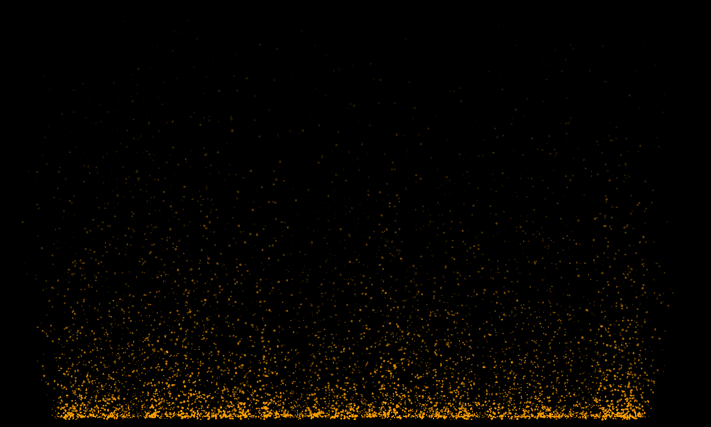

# my-odin-libs

A collection of Odin-lang libraries that I'm making for a personal 2d game engine. I want to keep these as simple as possible.

## [audio.odin](audio.odin)

A simple wrapper around miniaudio with error checking and audio asset management.

## [monitors.odin](monitors.odin)

Functions to move our game window to the primary monitor and get the primary monitor.

## [file_dialog](file_dialog/)

Open and save file dialogs for Odin using the native file dialog library for Windows and zenity/kdialog on Linux. Also include support for popup dialogs.

## [particle.odin](particle.odin)

A Particle Emitter that can be used as a jumping off point for a more complex Particle Emitter.

Includes support for gravity, wind, drag, and collisions.



## [vec2.odin](vec2.odin)

2D vector that support float 32 and float 64.

Raylib doesn't support 64 floats, so this is my attempt to do this my self. At least start to.

## [execute_command.odin](execute_command.odin)

Lets you run a command and get stdout.

Example Usage:

```odin
root_buf: [1024]byte
data := root_buf[:]
code, ok, out := run_executable("ls -lah", &data)
fmt.println(string(out))
```

## [aseprite.odin](aseprite/aseprite.odin)

Parses an exported Aseprite json sprite sheet.

Mostly this is inteded for getting the slice positions in the image.

This assumes the only settings changed in the Output tab are:

* Checking: Output File and JSON Data
* Unchecking Meta: Layers and Tags

Example Usage:

```odin
mySprite := ReadAsespriteJsonFile("assets/mySprite.json")
```
